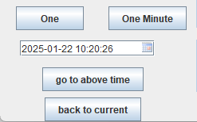

<b>The performance monitor for Oracle database</b>

----

## What is OraMonitor

> English | [中文](README_zh.md)

[OraMonitor](https://huangkj.com/) is a performance monitor for oracle, it can monitor active load, active sql, 
top sql and wait events, expensive sql in cursor, blocked sql and sql tunes.

The following screenshots give a close insight into OraMonitor. Please
check [What is OraMonitor](https://huangkj.com/docs/introduction/what-is-oramonitor/) for further information.

<table>
  <tr>
      <td width="50%" align="center"><b>Overview</b></td>
      <td width="50%" align="center"><b>SQL Tuning</b></td>
  </tr>
  <tr>
     <td></td>
     <td></td>
  </tr>
  <tr>
      <td width="50%" align="center"><b>Snapshot</b></td>
      <td width="50%" align="center"><b>Performance Monitor</b></td>
  </tr>
  <tr>
     <td></td>
     <td></td>
  </tr>
</table>

## Features

  
<b>🕸 Overview Performance</b>

  Support sysStat the performance metrics of database. <a href="https://huangkj.com/docs//">Learn more</a>.
  

  
<b>🔗 Snapshot</b>

  Provide snapshot screen to easily compare the performance in different times.
  

  
<b>🤖 Sql tuning</b>

  Provide sql tuning advice . <a href="https://huangkj.com/">Learn more</a>.
  

  
## Latest release

🎉 OraMonitor v1.0.1 plan released in Jan 2025!.

## Installation

OraMonitor can run many modern operating systems, such as Windows, Linux and Mac

### Quick start

#### Installing on Windows
We use the jpackage tool to produce a Java application image that includes all the necessary dependencies.
It will be able to produce a native package in a platform-specific format, such as an exe on Windows or a dmg on macOS. So you can double click the oramonitor.exe to run the app.

#### Installing on Linux
We provide deb package on ubuntu system and rpm package on redhat/centos system, so you can use dpkg -i oramonitor.deb on ubuntu or rpm -ivh oramonitor.rpm to install the app,the install directory is /opt/oramonitor/,you can use jar -jar command to run the app

#### Installing on Mac
On mac system,we provide dmp package to install the app

## Landscapes

  
&nbsp;&nbsp;&nbsp;&nbsp;
  
OraMonitor is a performance monitor of database.

