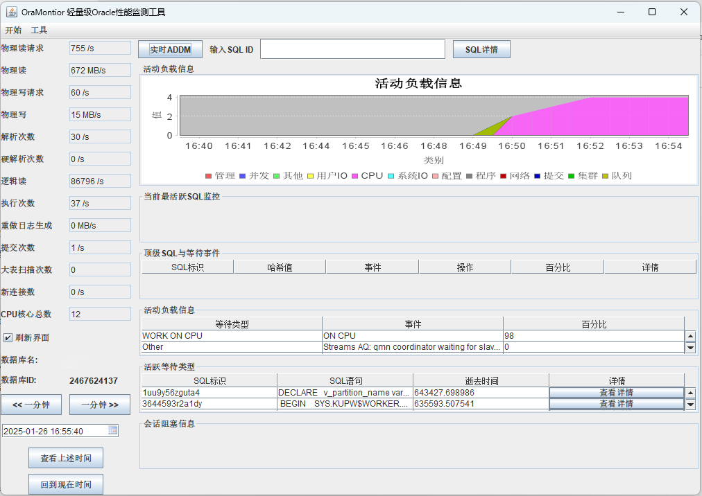
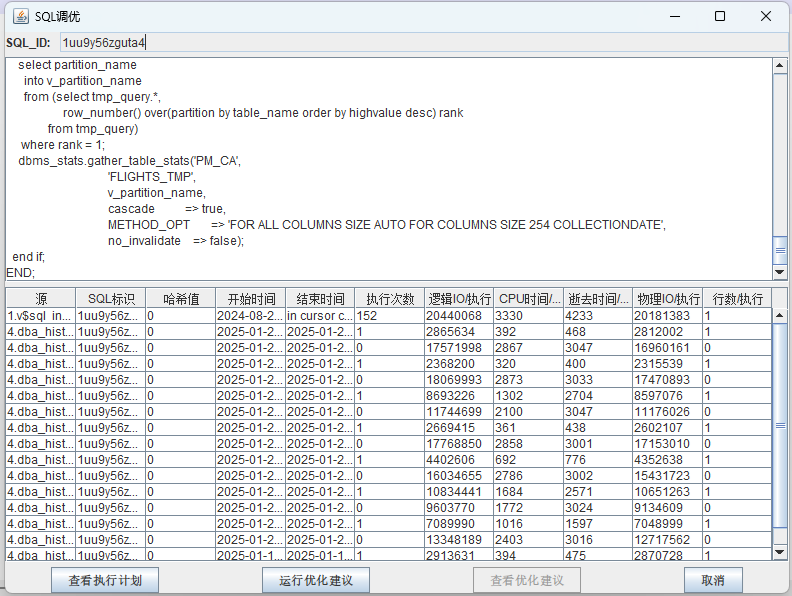

<b>轻量级Oracle性能监控工具</b>

----

## OraMonitor

> English | [中文](README_zh.md)

[OraMonitor](https://huangkj.com/) 是一个轻量级的oracle性能监控工具, 它能够监控系统负载，如sql语句，按照等待事件排序的sql，顶级等待事件，活跃会话的等待事件，会话阻塞，按照等待事件绘制的图形等。

下面的截图是一个总览，. 请点击 [什么是OraMonitor](https://huangkj.com/docs/introduction/what-is-oramonitor/) 获取更多信息。

<table>
  <tr>
      <td width="50%" align="center"><b>总览</b></td>
      <td width="50%" align="center"><b>SQL调优</b></td>
  </tr>
  <tr>
     <td></td>
     <td></td>
  </tr>
  <tr>
      <td width="50%" align="center"><b>快照</b></td>
      <td width="50%" align="center"><b>性能监控</b></td>
  </tr>
  <tr>
     <td></td>
     <td></td>
  </tr>
</table>

## 功能特性

  
<b>🕸 总览</b>

  提供总览视图，关注会话、SQL等性能监控指标及视图<a href="https://huangkj.com/docs//">Learn more</a>.
  

  
<b>🔗 快照</b>

  提供快照，易于比较不同时间的系统指标
  

  
<b>🤖 SQL调优</b>

  提供SQL调优建议<a href="https://huangkj.com/">Learn more</a>.
  

  
## 最新版本

🎉 OraMonitor v1.0.1版本发布于2025年1月

## 如何安装

OraMonitor 能够运行在很多操作系统，如Windows，Linux，Mac等

### 快速安装

#### 安装到Windows系统
我们使用jpackage工具来打包应用程序，应用程序包括运行所需的全部依赖，如jre运行环境等，您可以通过鼠标双击oramonitor.exe来运行次程序。

#### 安装到Linux系统
在乌班图操作系统，我们提供deb安装包，你可以通过dpkg -i oramonitor.deb，红帽/Centos系统提供rpm安装包，您可以通过rpm -ivh oramonitor.rpm来安装此应用，安装路径位于/opt/oramonitor下，最后通过jar -jar 命令来运行此程序，但前提是需要配置java环境变量，该目录下也包括jre运行环境，具体配置请搜索百度

#### 安装到苹果系统
在苹果操作系统上，我们提供dmg安装包

## 导航

  
&nbsp;&nbsp;&nbsp;&nbsp;
  
OraMonitor数据库性能监控工具.

